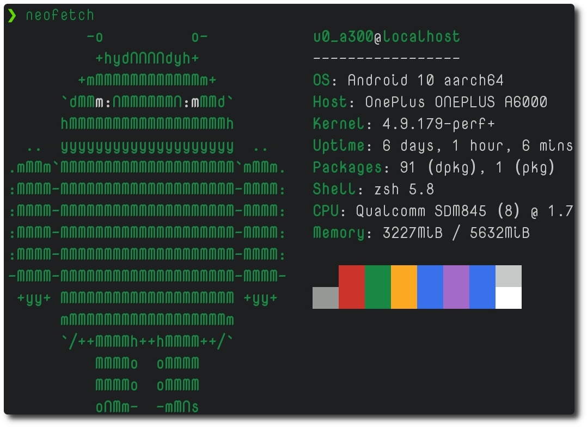
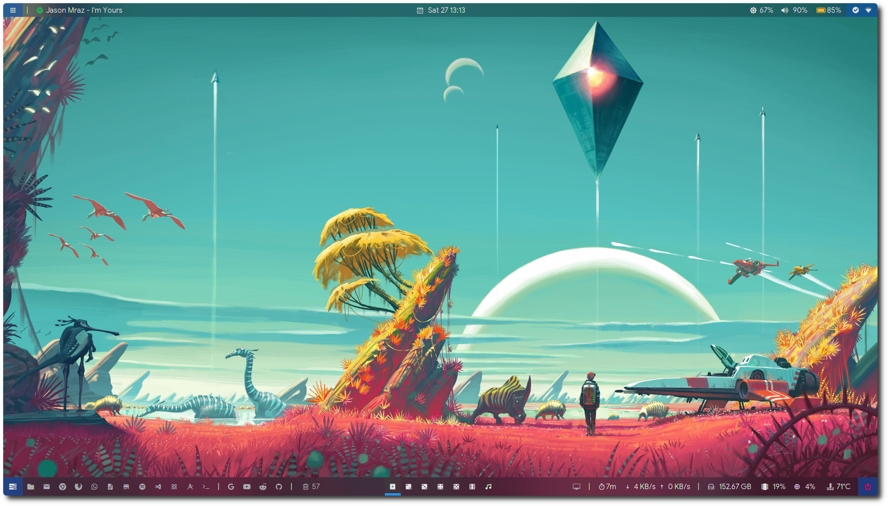
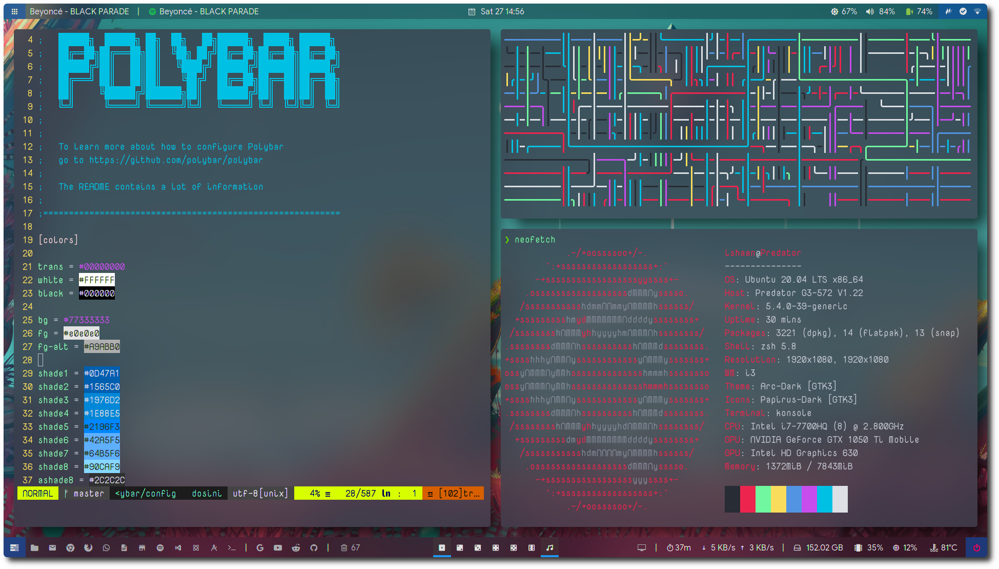
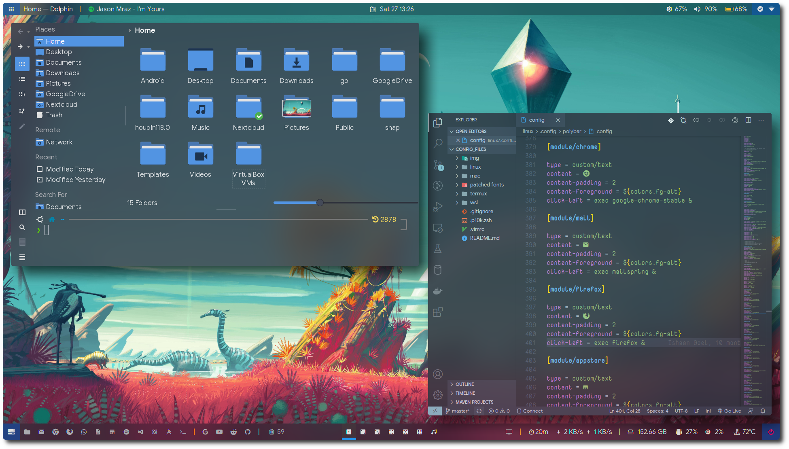

# Ubuntu, Mac, Termux and WSL Configuration files

These are all my config files from different systems I use and also some patched nerdfonts. I try to keep this repo updated and add more stuff regularly.

## Table of Contents

1. [Important Notes](#Important-Notes)
2. [Pro Tip](#Pro-Tip)
3. [Terminal Theme](#Terminal-Theme)
    1. [Ubuntu](#Ubuntu)
    2. [Mac](#Mac)
    3. [WSL](#WSL)
    4. [Termux](#Termux)
4. [i3](#i3)
    1. [i3-gaps-rounded-corners](#i3-gaps-rounded-corners)
    2. [Compton-tryone](#Compton-tryone)
    3. [Polybar](#Polybar)
    4. [Rofi](#Rofi)

## Important Notes

1. The Polybar config file has only been tested on Acer Predator Helios 300 G-572. Therefore, many modules in it correspond to its hardware only. You will need to change hardware module settings to match your hardware. (see the polybar section for more info)
2. The linux  and i3 config files have been tested on a fresh install of Ubuntu and XUbuntu 20.04.
3. The mac config files have been tested on Mac Os Catalinia 10.15.4.

### Pro Tip

 You can soft link the config files and aliases files to the desired location directly from the git repo so that your changes can be directly uploaded to your github if you choose to do so.

 *In any case, the files will still work if you just copy them to there supposed location*.

  ```shell
  cd <location to where the file is supposed to be linked>
  ln -sf <location of original files> <name of the linked file>
  ```

## Terminal Themes

##### Dependencies

- [oh-my-zsh](https://github.com/ohmyzsh/ohmyzsh) (For the zsh shell replacing bash)
- [zsh-syntax-highlighting](https://github.com/zsh-users/zsh-syntax-highlighting) (For syntax highlighting in the terminal!)
- [Powerlevel10k](https://github.com/romkatv/powerlevel10k) (For the theme)
- [Nerd Fonts](https://github.com/ryanoasis/nerd-fonts) (For the glyphs)
  - I am using modified [NovaMono](https://fonts.google.com/specimen/Nova+Mono) font available in the patched fonts folder

### Ubuntu


Terminal: [Konsole](https://github.com/KDE/konsole)

*The blur comes from compton-trypne*

#### Steps to install

- Soft Link or copy the `linux/.zshrc` and `.p10k.zsh` files in your `$HOME` folder
- run ```source ~/.zshrc```
- make sure the font of the terminal is set to a Nerd Font

### Mac


Terminal: [iTerm2](https://www.iterm2.com/)

#### Steps to install

- Soft Link or copy the `mac/.zshrc` and `.p10k.zsh` files in your `$HOME` folder
- run ```source ~/.zshrc```
- make sure the font of the terminal is set to a Nerd Font

### WSL


Terminal: [Windows Terminal](https://github.com/microsoft/terminal)

#### Steps to install

- Soft Link or copy the `linux/.zshrc` and `.p10k.zsh` files in your `$HOME` folder
- run `source ~/.zshrc`
- make sure the font of the terminal is set to a Nerd Font
- For acrylic background, copy the properties from `wsl/Windows Terminal/profiles.json` to the settings of windows terminal

### Termux



Terminal: [Termux](https://github.com/termux/termux-app)

#### Steps to install

- Soft Link or copy the `linux/.zshrc` and `.p10k.zsh` files in your `$HOME` folder
- run `source ~/.zshrc`
- To set a custom font, copy the .termux folder from `termux/.termux` to `$HOME`
  - You can change the font by placing a .ttf file in this folder, but it has to be named "font.ttf"

## i3



[Wallpaper](https://www.wallpapermaiden.com/wallpaper/8457/no-man-s-sky-landscape-artwork-planet-spacecraft/download/1280x800)

#### Dependencies

```shell
sudo apt install curl cmake libxcb1-dev libxcb-keysyms1-dev libpango1.0-dev \
	libxcb-util0-dev libxcb-icccm4-dev libyajl-dev \
	libstartup-notification0-dev xbacklight libxcb-randr0-dev \
	libev-dev libxcb-cursor-dev libxcb-xinerama0-dev \
	libxcb-xkb-dev libxkbcommon-dev libxkbcommon-x11-dev \
	autoconf libxcb-xrm0 libxcb-xrm-dev automake libxcb-shape0-dev \
	gcc make dh-autoreconf libxcb-keysyms1-dev \
	libpango1.0-dev libxcb-util0-dev xcb libxcb1-dev libxcb-icccm4-dev \
	libyajl-dev libev-dev libxcb-xkb-dev libxcb-cursor-dev libxkbcommon-dev \
	libxcb-xinerama0-dev libxkbcommon-x11-dev libstartup-notification0-dev -y

sudo apt install libxcb-randr0-dev libxcb-xrm0 libxcb-xrm-dev libxcb-shape0 libxcb-shape0-dev build-essential git cmake cmake-data pkg-config python3-sphinx \
	libcairo2-dev libxcb1-dev libxcb-util0-dev libxcb-randr0-dev \
	libxcb-composite0-dev python3-xcbgen xcb-proto libxcb-image0-dev \
	libxcb-ewmh-dev libxcb-icccm4-dev \
	libxcb-xkb-dev libxcb-xrm-dev libxcb-cursor-dev libasound2-dev \
	libpulse-dev libjsoncpp-dev libmpdclient-dev libcurl4-openssl-dev \
	libnl-genl-3-dev fonts-materialdesignicons-webfont kitty indent \
	libanyevent-i3-perl \
	libx11-dev libxcomposite-dev libxdamage-dev libxfixes-dev libxrandr-dev \
	libxinerama-dev libconfig-dev libdbus-1-dev \
	mesa-common-dev asciidoc lxappearance \
	gtk-chtheme qt5ct freeglut3-dev feh jq libxcb-render0-dev libffi-dev yad xdotool\
    python-dev python-cffi -y

sudo apt install viewnior scrot mpc acpi dunst filelight texinfo \
	gnome-disk-utility gnome-system-monitor aptitude texinfo dolphin konsole -y

# Rofi dependencies
sudo aptitude install libjpeg-dev librsvg2-dev libglib2.0-dev -y
```

### i3-gaps-rounded-corners



#### Steps to install

- Make sure the above dependencies are installed
- complie and intstall i3 from <https://github.com/resloved/i3>
- Soft link or copy the `linux/.config/i3/config` to `~/.config/i3`
- Reboot

##### Note

The i3 config file includes the following line:

```shell
# Dual Display setting 
exec_always --no-startup-id xrandr --output eDP-1-1 --right-of HDMI-0 --auto`
```

Remove it if you use a single display or change it according to your screens.

### Compton-tryone



#### Steps to install

- complie and intstall compton from<https://github.com/tryone144/compton.git>
- Soft link or copy the `linux/.config/compton.conf` to `~/.config`
- Reboot

### Polybar


#### Steps to install

- complie and intstall polybar from<https://github.com/polybar/polybar>
- Make sure the 'GoogleSans Nerd Font' is installed from the patched fonts folder
- Soft link or copy the `linux/.config/polybar` folder to `~/.config`
- Refer to [Polybar Wiki](https://github.com/polybar/polybar/wiki) to configure the moduels according to your hardware.
- Reload i3 window or run it from `linux/.config/polybar/launch.sh`

### Rofi

The rofi themes are heavily influenced from <https://github.com/adi1090x/rofi>


#### Steps to install

- complie and intstall rofi from <https://github.com/DaveDavenport/rofi>
  - **The apt package of rofi is an older version and doesnot work with the config files provided**
  - **You would need to complie and install the latest version of check from <https://github.com/libcheck/check.git> to install rofi. The version included in apt is old.**
- Make sure polybar is installed properly
- Soft link or copy the `linux/.config/rofi` folder to `~/.config`
